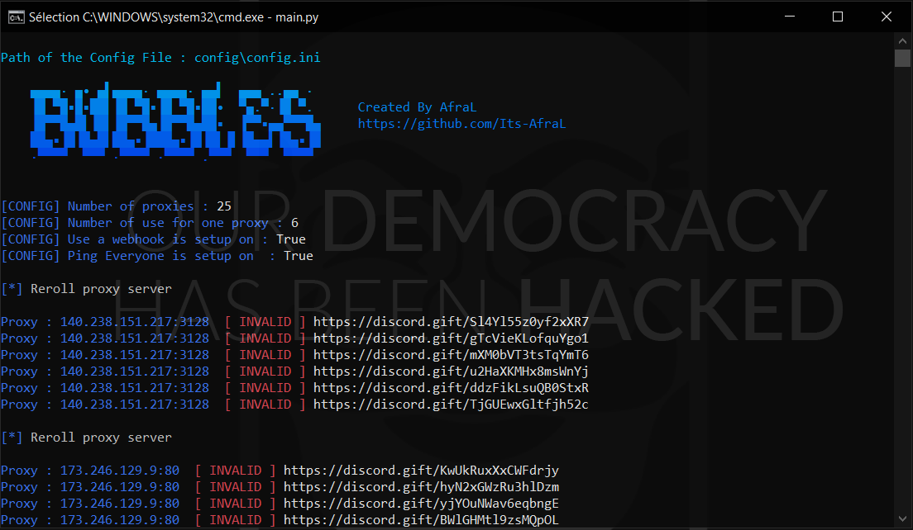

  
  
  <h3 align="center">Bubbles Nitro Gen & Check</h3>

  

    A powerful discord nitro generator and checker with http proxies servers
     
  

With **Bubbles**, you can generate 16 characters Discord nitro gifts codes and check them to try to find a **valid Nitro code**, **Bubbles is really powerfull**, he check nitro gifts codes using **HTTP proxies servers** saved in *ressources/proxies.txt (see Installation instructions)*
